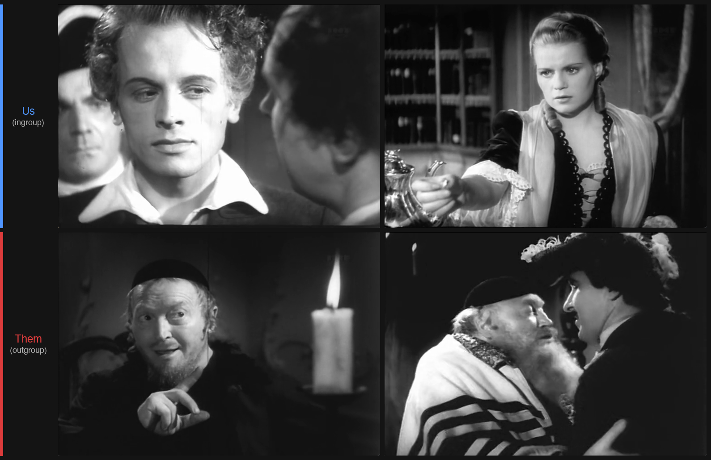

# The Visual Construction of the Enemy

**Cultural Analytics Project – Winter Term 2025/26**
**Leipzig University**

A quantitative analysis of "Us" vs. "Them" visual representation in Nazi-era films.

---

## Research Question

Which visual features did Nazi film production systematically employ to distinguish the ingroup ("Us") from the outgroup ("Them")? Can these differences be learned automatically, and which visual features are most relevant for this distinction?

The analysis focuses on the ideological primary enemies of Nazi ideology — Jews, Communists, Slavs — rather than the depiction of Western Allies.

---

## Annotation Examples



*Left column: frames labeled **us** (ingroup) — bright, centered, ordered compositions. Right column: frames labeled **them** (outgroup) — dark, low-key lighting, dramatic staging. Film: Jud Süß (1940).*

---

## Results Summary

| Film | Samples (us/them) | Balanced CV-Acc. (5-fold) | CV Std. |
|------|-------------------|---------------------------|---------|
| *Jud Süß* (1940) | 171 / 178 | 62.4% | ±5.1% |
| *Heimkehr* (1941) | 216 / 89 | 56.4% | ±10.9% |
| *Hans Westmar* (1933) | 105 / 113 | 59.7% | ±11.0% |

**Leave-One-Movie-Out CV (LOMOCV):** 54.0% ± 5.9% balanced accuracy across 3 films.

Within-film classification works (56–65%), indicating that visual features do capture ingroup/outgroup differences within a single film. However, cross-film generalization is near chance level, suggesting that the visual grammar of propaganda is film- and context-specific rather than following a single unified doctrine across enemy types (antisemitic, anti-Slavic, anti-Bolshevik).

**Top features (consistent across films):** `dof_variance`, `contrast`, `mean_brightness`, `edge_density`, `texture_contrast`

### Corpus Limitations

Four additional films were annotated and processed (*Der ewige Jude*, *SA-Mann Brand*, *Feinde*, *Hitlerjunge Quex*) but excluded from the final baseline and LOMOCV results due to:

- **Video quality issues:** Significant noise in color and resolution across source copies, introducing systematic artifacts into low-level visual features.
- **Class imbalance:** Severe imbalance between `us` and `them` frames made balanced training infeasible.
- **Lack of corpus heterogeneity:** These films did not introduce new enemy types or new ingroup constructions beyond those already covered by the three retained films, making their marginal contribution to generalization testing negligible while their quality issues added confounds.

---

## Methodology

### Data Collection & Annotation
- Manual frame-by-frame annotation using interactive viewer (`scripts/annotate_viewer.py`)
- 3 active labels: `us` (ingroup), `them` (outgroup), `other` (ambiguous/irrelevant)
- Only `us` and `them` are used for training — `other` serves as a quality filter to exclude ambiguous frames
- Two annotators with different levels of film context (see report for inter-annotator agreement)

### Feature Extraction
- 22 visual features across 7 categories: lighting, color, composition, texture, region properties, face detection, depth of field
- Automated extraction using OpenCV (`src/feature_extraction.py`)
- Automatic subtitle removal: crops bottom 12% of frames before feature extraction

### Classification & Validation
- Random Forest classifier (100 estimators, max depth 10, balanced class weights)
- **Primary metric: balanced accuracy** (accounts for class imbalance — raw accuracy is misleading)
- **Leave-One-Movie-Out CV (LOMOCV):** train on N−1 films, test on held-out film, rotate through all films

### Visual Features (22 total)

| Category | Features |
|----------|----------|
| **Lighting (5)** | mean_brightness, brightness_std, contrast, low_key_ratio, high_key_ratio |
| **Color (5)** | saturation_mean, saturation_std, hue_mean, hue_std, color_temperature |
| **Composition (4)** | edge_density, center_brightness, vertical_symmetry, horizontal_symmetry |
| **Texture (2)** | texture_contrast, texture_homogeneity |
| **Regions (2)** | dark_regions_count, bright_regions_count |
| **Face Detection (3)** | face_count, face_area_ratio, largest_face_y_position |
| **Depth of Field (1)** | dof_variance |

---

## Dataset

**Source:** [Internet Archive – German Films 1933–1945](https://archive.org/details/movies?and%5B%5D=mediatype%3A%22movies%22&and%5B%5D=language%3A%22German%22&and%5B%5D=year%3A%5B1933+TO+1945%5D)

### Films Used

| Film | Year | Type | Feindbild |
|------|------|------|-----------|
| *Hans Westmar* | 1933 | Feature | Anti-Bolshevik |
| *Triumph des Willens* | 1935 | Documentary | Ingroup only |
| *Jud Süß* | 1940 | Feature | Antisemitic |
| *Heimkehr* | 1941 | Feature | Anti-Polish/Slavic |

---

## Quick Start

```bash
# Setup
python3 -m venv venv
source venv/bin/activate
pip install -r requirements.txt

# Extract frames (requires shot detection file from TransNet)
python scripts/extract_frames.py data/videos/<film>.mp4 data/shots/<film>.scenes.txt

# Annotate frames
python scripts/annotate_viewer.py frames/<film> data/annotated/kevin/<film>_annotations.csv

# Extract visual features
python src/feature_extraction.py frames/<film> data/features/<film>_features.csv

# Single-film baseline
python src/model.py data/features/<film>_features.csv data/annotated/kevin/<film>_annotations.csv results/<film>

# Multi-film LOMOCV
python scripts/train_multi_film.py \
  --films jud_suess heimkehr hans_westmar \
  --features-dir data/features \
  --annotations-dir data/annotated/kevin \
  --output results/multi_film
```

See [PIPELINE.md](PIPELINE.md) for full step-by-step documentation.

---

## Project Structure

```
├── src/
│   ├── feature_extraction.py   # Visual feature extraction (22 features)
│   └── model.py                # Single-film Random Forest classifier
├── scripts/
│   ├── annotate_viewer.py      # Interactive annotation viewer (OpenCV)
│   ├── extract_frames.py       # Video → frames extraction
│   ├── filter_frames.py        # Frame filtering utilities
│   └── train_multi_film.py     # Leave-One-Movie-Out cross-validation
├── data/
│   ├── annotated/              # Annotation CSVs (kevin/, felix/)
│   └── features/               # Extracted feature CSVs per film
├── frames/                     # Extracted frames organized by film
├── results/
│   ├── jud_suess/              # Single-film results
│   ├── heimkehr/               # Single-film results
│   ├── hans_westmar/           # Single-film results
│   ├── multi_film/             # LOMOCV results
│   └── images_for_report/      # Figures for the paper
├── PIPELINE.md                 # Step-by-step pipeline documentation
└── requirements.txt
```

---

## Authors

| | Kevin Kunkel | Felix Filius |
|---|---|---|
| **Program** | M.Sc. Computer Science | M.Sc. Data Science |
| **E-Mail** | mm21lugi@studserv.uni-leipzig.de | zq25ohog@studserv.uni-leipzig.de |
| **Student ID** | 3738957 | 3773660 |

---

## Disclaimer

The films analyzed in this project contain National Socialist propaganda and antisemitic content. This analysis serves exclusively academic purposes in the context of historical research and education.
